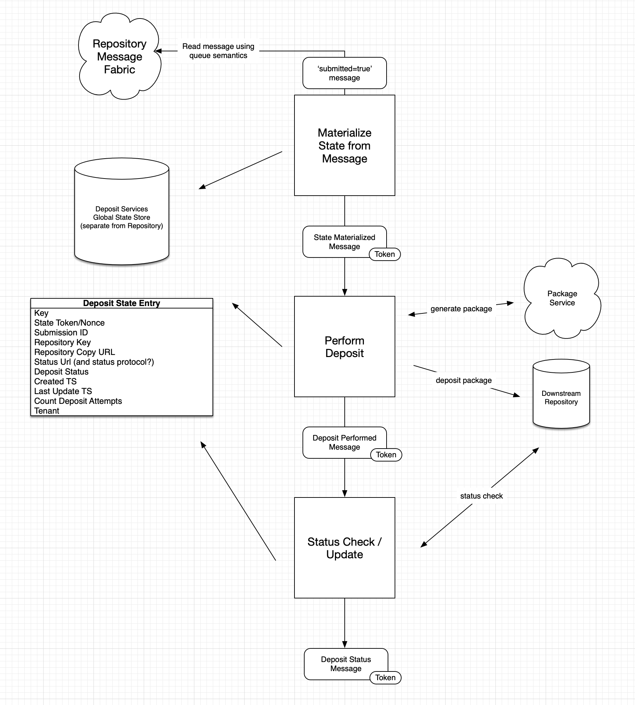

# Guidelines Future Directions

The following should be taken as guidelines or suggestions, not as hard-and-fast rules for what to do with Deposit
Services, with an eye to future development especially as it pertains to cloud-readiness, self-service, and
multi-tenancy.

In my opinion, the existing version of Deposit Services is not well-suited for future development. The codebase is
complex, hard to understand, and it will be challenging to implement some of these guidelines without ripping out major
parts of the codebase. It is over-engineered in places, and deserves to be simplified for maintainability.

## Operational Concerns

Deposits may fail for any number of reasons, so it is imperative that there be some sort of administrative console that
allows for an administrator to retry a deposit. The current method (based on modifying the Submission resource) is
error-prone, clumsy, and does not allow for tenets to be empowered to troubleshoot and address issues on their own.

Another drawback of the current method is that it only works at the Submission level, which would prompt even successful
Deposits to be re-performed.

## Message Delivery

Ideally, deposits to downstream repositories should be performed exactly once, but we can't achieve that guarantee. So
the question is, do we err on the side of performing a deposit at least once, where the downstream repository may see a
duplicate deposit, or err on the side of performing a deposit at most once, where the downstream repository may never
see the deposit?

The consequences of performing the same deposit twice to a downstream repository can't really be reasoned about, since
they are dependent on the workflows and procedures the downstream repository has in place for receiving packages.
Consequences of duplicate downstream deposits could include:

* cost of processing and validating a duplicate package
* cost of provisioning a unique identifier for the content (services for provisioning unique ids cost money)
* appearance of duplicate objects in the downstream repository
* human resources spent remediating duplicates
* political fallout as PASS gains a reputation for being unreliable

Therefore, it is proposed that Deposit Services perform downstream deposits at most once, unless directed to perform a
second deposit by an administrator. There are potential consequences of this approach, but they can all be mediated by
the core PASS team without involving the downstream repository. These consequences could include:

* missing deposits: the deposit is never submitted to the downstream repository
* political fallout as PASS gains a reputation for being unreliable
* human resources spent remediating missing deposits

The problems associated with at-most-once can be mitigated by putting robust monitoring in place. For example, if there
is a deposit that hasn't completed within a few hours of submission, then an alert should be raised and investigated by
the core PASS team.

## State Management

State for each deposit must be maintained in order to achieve idempotence when duplicate messages are encountered.
Fedora (and the public PASS model) is currently used to manage state, but discussions with EF have pointed to using a
distinct state store, separate from the Repository. The state store does not, and probably should not, be a part of the
public PASS model.

State tokens can be passed along with messages to ensure conflicts do not occur when updating the state store. Assigning
a new value to the state token in the state store (where the new value is saved only if the expected state token matches
the actual state token in the store) prior to attempting a deposit to the downstream repository is a critical measure to
implementing at-most-once deposits.

Multiple nodes may be processing deposits, so one question to answer is whether there is a state store per node, or a
global state store used by all nodes. This document recommends the latter, since it will be easier for a monitoring
application or PASS engineers to query a single store for information rather than aggregating information from multiple
stores.

## Package Service

The current version of the deposit service is also responsible for generating packages. This has nothing to do with
managing the transfer of custody from the end user to the downstream repository. The Assembler and the Package Providers
ought to be moved into a stand-alone Package service with an HTTP API.

This removes a lot of complexity from the Deposit Services code base, and allows packaging-related features to evolve
separately. One feature of the Package service is for an institutional administrator to provide a mapping between PASS
metadata and the downstream package metadata. This is currently hard-coded in package providers, but it ought to be
generalized into some form of mapping and/or templating framework. Allowing this kind of extensibility in the Package
Service would be difficult to do if it remains entangled with the Deposit Service.

## Bringing it Together

In the cloud, there may be multiple instances of deposit services running. Multiple nodes processing deposits for any
number of tenants. Deposits need to be robustly monitored for failures (and successes!), and alerts need to be raised in
the case of failure. Rewriting or a major refactoring is needed to achieve these goals.

A global state store is used to track the status of a given deposit; interactions with the PASS Repository are minimal.

The three main functions, 1) materializing deposit state from a message, 2) generating the package and performing the
deposit, and 3) updating the status of a deposit are envisaged as three distinct microservices communicating
asynchronously across a message fabric. Regardless of their ultimate implementation (as these are just guidelines),
those three main functions must be implemented in some shape or form.

Testing most of thse microservices can be done easily by instantiating a mock state store, but the "Perform Deposit"
microservice will need a mocked Package Service and Downstream Repository.

