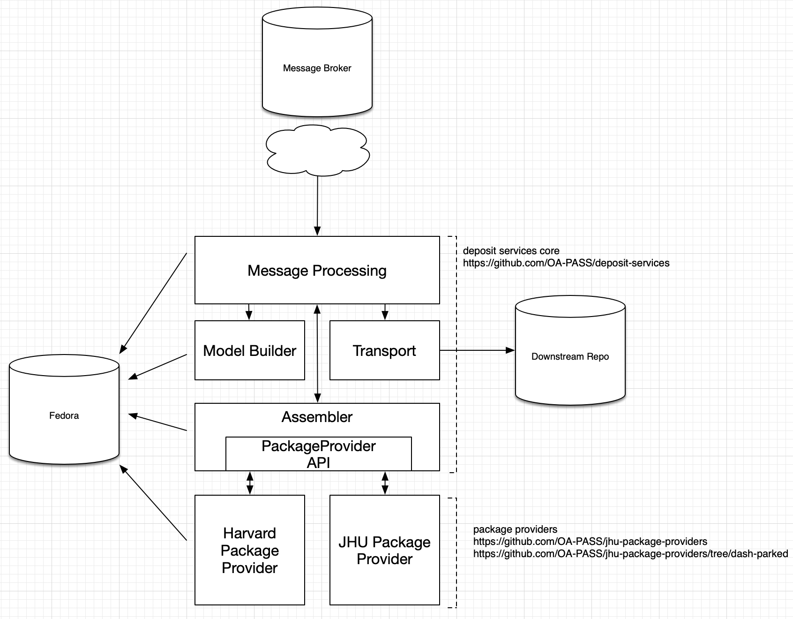
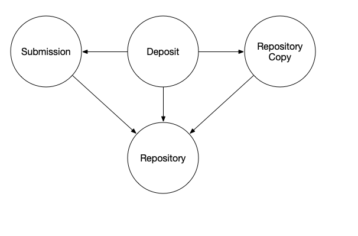

# Deposit Services Overview

Provides an overview of Deposit Services with respect to developing Deposit Services package providers.

Developing a package provider primarily deals with extending or re-using `Assembler`-related abstract classes and
implementations, but it helps to understand the context in which `Assembler`s operate. This document serves to provide
that context.

## Architecture

This is a logical diagram of the Deposit Services software architecture, including notes on which code repositories
house the code.

* "Message Processing" is a logical component that encompasses the primary classes responsible for operating on the JMS
  messages received by Deposit Services. This includes the `Policy` implementations as well as the `SubmissionProcessor`
  and `DepositProcessor` classes.
    * "Message Processing" orchestrates the communication between various components.
* The Assembler provides a streaming package to be delivered to the downstream repository
    * Package Providers can be developed independently for each institution.
    * Even though the Harvard Package Provider is represented as a logically separate component, the code including the
      Harvard provider is co-located in the JHU Package Providers code repository, since JHU wrote and maintains the
      code. (See the `dash-parked` [branch](https://github.com/OA-PASS/jhu-package-providers/tree/dash-parked))

### Future work

The Assembler and Package Providers could be extracted from Deposit Services into a separate Packaging microservice,
with its own HTTP API. There are a number of advantages with this approach. Aside from simplifying the testing,
packaging, and release process of Deposit Services, these advantages include:

* Ability to export the content of a Submission independent of performing deposit (think of allowing an administrator or
  end-user to download their content)
* Ability to evolve the features relating to packaging. For example, it would be quite clumsy to support an end-user
  driven mechanism for customizing package metadata with the current software architecture.

## Application Structure

1. Deposit Service is
   a [Spring Boot application (v2.1.12)](https://docs.spring.io/spring-boot/docs/2.1.2.RELEASE/reference/html/)
2. There are a number of interfaces used by Deposit Services. Some of these interfaces have implementations that are
   discovered at runtime. For
   example, [Package Providers](https://github.com/OA-PASS/deposit-services/blob/master/ASSEMBLER.md#runtime) are
   discovered at runtime by examining the classpath, aided by Spring Boot `AutoConfiguration`.
3. Package providers can be added to Deposit Services by adding a package provider and its dependencies to the runtime
   classpath of the Deposit Services Spring Boot application.
    1. Each package provider produces an image that contains its jar file and dependencies
        1. [BagIT](https://github.com/OA-PASS/jhu-package-providers/blob/master/bagit-package-provider/Dockerfile)
        2. [J10P](https://github.com/OA-PASS/jhu-package-providers/blob/master/jscholarship-package-provider/Dockerfile)
        3. [PMC](https://github.com/OA-PASS/jhu-package-providers/tree/master/nihms-package-provider)
        4. [Harvard DASH](https://github.com/OA-PASS/jhu-package-providers/blob/dash-parked/dash-package-provider/Dockerfile) (
           note this is on the `dash-parked` branch)
    2. Then each provider's jars and libs
       are [copied into](https://github.com/OA-PASS/jhu-package-providers/blob/master/provider-integration/src/main/docker/Dockerfile)
       the Spring Boot application's `BOOT-INF/lib` directory. This image is released as the package providers image.
        1. Note that
           the [final `FROM` inherits](https://github.com/OA-PASS/jhu-package-providers/blob/master/provider-integration/src/main/docker/Dockerfile#L8)
           from
           the [core deposit services image](https://github.com/OA-PASS/deposit-services/blob/master/deposit-messaging/Dockerfile)
    3. Therefore, the package providers image contains the core deposit service code, and all package providers.
4. pass-docker's [docker-compose.yml](https://github.com/OA-PASS/pass-docker/blob/master/docker-compose.yml#L201-L217)
   along with the pass-docker deposit-service/Dockerfile marries the configuration with the package providers image.

## Release Process

The release process for Deposit Services is complex, and documented in
the [pass-docker repository](https://github.com/OA-PASS/pass-docker/blob/master/deposit-services/README.md).

Here is some background and highlights:

1. A release of the [pass-docker Deposit Services](https://github.com/OA-PASS/pass-docker/tree/master/deposit-services)
   must include Package Providers on the runtime classpath in the image
2. This means that a release of pass-docker Deposit Services depends on making a release of the Deposit
   Services [core codebase](https://github.com/OA-PASS/deposit-services) first, followed by releases of
   the [package providers](https://github.com/OA-PASS/jhu-package-providers), followed by the creation of the
   pass-docker/deposit Docker image
    1. The Spring Boot application is deployed in exploded form, _not_ as a self-executable jar. This allows for package
       providers to be added to the runtime classpath by using the core deposit services image as the base image in
       a `FROM` statement (see
       the [package-providers Dockerfile](https://github.com/OA-PASS/jhu-package-providers/blob/d46525daf40f5b35b1bc494324246d8f137951e4/provider-integration/src/main/docker/Dockerfile)
       as an example)
3. A "release" means publishing release versions (no `-SNAPSHOT`) of each Java artifact, and publishing a Docker image
    1. This must be done for the `deposit-services`and `package-providers` code repositories
    2. See [here](https://github.com/OA-PASS/pass-docker/tree/master/deposit-services#releasing-images)
4. Docker images and Java code artifacts for Deposit Services core are built by Maven, _not_ by manually
   invoking `docker build`.
5. Docker images and Java code artifacts for Package Providers are built by Maven, _not_ by manually
   invoking `docker build`.
    1. TL;DR: running `mvn install` from
       the [base of the package-providers repo](https://github.com/OA-PASS/jhu-package-providers) should result in all
       images being built
    2. Each Package Provider must have a Docker image built
        1. [bagit-package-provider](https://github.com/OA-PASS/jhu-package-providers/blob/master/bagit-package-provider/Dockerfile)
        2. [jscholarship-package-provider](https://github.com/OA-PASS/jhu-package-providers/blob/master/jscholarship-package-provider/Dockerfile)
        3. [nihms-package-provider](https://github.com/OA-PASS/jhu-package-providers/blob/master/nihms-package-provider/Dockerfile)
    4. Then all the Package Providers are collapsed into a single package
       provider [uber-image](https://github.com/OA-PASS/jhu-package-providers/blob/d46525daf40f5b35b1bc494324246d8f137951e4/provider-integration/src/main/docker/Dockerfile)
6. Finally, the Docker image in `pass-docker/deposit-services` can be built and deployed.
    1. Set the correct values for the build arguments
       in [pass-docker/docker-compose.yml](https://github.com/OA-PASS/pass-docker/blob/90557db2bc774ec824b700f9b0ff9b54ee687325/docker-compose.yml#L201)

## Model

Overview of model entities relevant to Deposit Services.

### PASS Model

Deposit Services uses objects in
the [PASS data model](https://github.com/OA-PASS/pass-data-model/tree/master/documentation) (distinct from the Deposit
Services' internal model). Objects in the PASS data model are persisted in the Fedora repository. Thus, any interaction
with PASS resources will require CRUD operations on resources held in Fedora (using the PASS Java client) by Deposit
Services.

PASS objects used by Deposit Services are:

* **`Submission`**: only ever read by Deposit Services, never modified.
* **`Repository`**: only ever read by Deposit Services, never modified.
* **`Deposit`**: are created and modified by Deposit Services.
* **`RepositoryCopy`**: are created and modified by Deposit Services (note that the NIHMS loader also creates
  RepositoryCopy resources)

Each `Submission` resource links to one or more `Repository` resources. Deposit Services will create a `Deposit`
and `RepositoryCopy` resource for each `Repository` linked to the `Submission`. A deposit attempt will be made by
Deposit Services to the downstream system represented by the `Repository`. The status of a deposit to a downstream
repository will be recorded on the `Deposit` resource. That is to say, the `Deposit` records the transaction and its
success or failure with a `Repository`, and the `RepositoryCopy` records where the Repository stored the content of
the `Deposit`.

### Deposit Services Internal Model

Deposit Services has an internal object model, distinct from the PASS data model. Instances of the internal object model
are not persisted in the PASS repository, or anywhere else. Upon receipt of a `Submission` (i.e. the external PASS
model), Deposit Services immediately converts it to an instance of the internal model using a Model Builder.

#### Deposit Model

* **`DepositSubmission`**: internal representation of a PASS Submission
* **`DepositMetadata`**: metadata describing the submission, parsed from the "metadata blob" (**`Submission.metadata`**)
  and other `Submission` properties.

#### Configuration Model

* **`Packager`**: encapsulates configuration of the `Assembler`, `Transport`, and `DepositStatusProcessor` for every
  downstream repository in `repositories.json`. Each repository configured in `repositories.json` ought to reference
  a `Repository` resource in the PASS repository.
* **`RepositoryConfig`**: Java representation of a single repository configuration in `repositories.json`. The
  configuration for a repository includes directives for the transport protocol used for deposit (including
  authentication credentials), packaging specification used for deposit, and packaging options.

#### Packaging Model

* **`Assembler`**: responsible for creating and streaming the content (i.e. the files uploaded by the end-user and any
  metadata required by the packaging specification) of a Submission according to a packaging specification
* **`PackageStream`**: content of a `Submission` to be deposited to a downstream repository as a stream, as opposed to
  bytes held in a buffer or stored on a file system
* **`Transport`**: an abstraction representing the physical protocol used to transfer the package stream from the PASS
  repository to the downstream repository.

#### Messaging Model

* **`DepositStatusProcessor`**: responsible for updating the `Deposit.depositStatus` property of a `Deposit` resource,
  typically by resolving the URL in the `Deposit.depositStatusRef` property and parsing its content.
* **`CriticalRepositoryInteraction`**: CRI for short. Performs an opportunistic (`If-Match` using an Etag) "critical"
  modification on a PASS resource, with a built-in retry mechanism when a modification fails. Each CRI has a
  pre-condition, critical section, and post-condition. The pre-condition must be met before the critical section is
  executed. The post-condition determines whether the application of the critical section was successful. The built-in
  retry mechanism re-uses the pre/post/critical functions in the case of a conflict.

## Model Builder

Upon receipt of a Submission, the `ModelBuilder` is invoked to produce an instance of `DepositSubmission`.
The `ModelBuilder` interface accepts a string representation of a `Submission` for conversion to `DepositSubmission`.
The string may be a blob representing the entirety of the submission (i.e. a serialization of a `Submission` together
with its linked resources), or it may be a URI reference to a `Submission` resource in the PASS repository.

### Fedora Builder

The `FedoraBuilder` implementation accepts a URI reference to a `Submission` resource in the PASS repository, and builds
a `DepositSubmission` by retrieving the `Submission` and its linked resources. This is the `ModelBuilder` implementation
used in production.

## Assembler

Responsible for assembling the content of a submission into a streamable package (i.e. the `Assembler` returns
a `PackageStream` instance). This includes:

* Resolving the custodial content being deposited from the PASS repository
* Generating any metadata required by the packaging specification
* Generating any metadata required by the downstream repository
* Encapsulating all of the above into a stream of bytes that meets a packaging specification

The work to implement the Configurable Metadata Framework focuses on the support of pluggable Assemblers within Deposit
Services: different `Assembler` implementations can include metadata required for their repository.

### Custodial and supplemental resources

The term _custodial resource_ is used throughout: a custodial resource is content that was uploaded by the end user for
deposit to a downstream repository: their data sets, manuscripts, etc. Non-custodial resources (i.e. _supplemental
resources_) include metadata describing the content, for example, BagIt tag files or DSpace METS XML files.

#### Abstract Assembler and Archiving Package Stream

There are two abstract classes to help developers create `Assembler` implementations. The `AbstractAssembler`
and `ArchivingPackageStream`.

The `AbstractAssembler` contains shared logic for building a list of custodial resources to be deposited. Concrete
implementations accept the list of custodial resources (among other parameters, including the packaging specification)
and produce the `PackageStream`.

The `ArchivingPackageStream` contains shared logic for assembling multiple files into a single zip, tar, or tar.gz file.

#### MetadataBuilder and PackageStream.Metadata

`PackageStream.Metadata` is an interface that provides package-level metadata. The `MetadataBuilder` is a fluent API for
creating physical package-level metadata such as:

* Packaging specification - a URI identifying the package specification used
* Package size (bytes) and its checksum
* The package name
* Mime type, compression used, and archive format

The `PackageStream.metadata()` method returns the `PackageStream.Metadata` for a `PackageStream` instance. Because some
metadata is unknown prior to streaming (e.g. the package size), the metadata returned by this method may be incomplete
until after the stream has been read.

#### ResourceBuilder and PackageStream.Resource

`PackageStream.Resource` is an interface that provides metadata describing a resource within the
package.  `ResourceBuilder` is a fluent API for creating physical metadata describing each resource (i.e. file) within
the package:

* File size (bytes)
* Filename, including its path relative to the package root
* Checksum and mime type

The `PackageStream.resources()` method answers an `Iterator` over each `Resource` in the `PackageStream`.

#### Package Provider

`PackageProvider` is an interface that is invoked by Deposit Services when a `PackageStream` is streamed to a repository
via a `Transport`.

`PackageProvider` represents a streaming lifecycle interface that has three methods: `start(...)`, `packagePath(...)`,
and `finish(...)`. The `start(...)` method is invoked after the custodial resources have been assembled, but before
streaming has started. The `packagePath(...)` method is invoked prior to streaming each custodial resource.
The `finish(...)` method is invoked after all the custodial resources have been streamed, and provides an opportunity
for the `PackageProvider` to add supplemental resources to the package being streamed.

For example, a BagIt `PackageProvider` would insure that each custodial resource is pathed under `<package root>/data`
when implementing `packagePath(...)`. After the the custodial resources are streamed, the BagIt `PackageProvider` would
assemble and stream all of the BagIt metadata: bagit.txt and any other tag files.

## Transport

Responsible for transferring the bytes of a package (i.e. a `PackageStream`) to an endpoint. The Transport API is
designed to support any transport protocol. Each downstream repository in `repositories.json` must be configured with
a `Transport` implementation.

The `Assembler` and the `PackageProvider` create the package, and the `Transport` is the "how" of how a package is
transferred to a downstream repository. Choosing the `Transport` to be used depends on the support of the downstream
repository for things like FTP, SWORD, or other protocols.

For example, a BagIt `Assembler` and `PackageProvider` would produce BagIt packages. Those packages may be transported
to downstream repositories using FTP, SWORDv2, or a custom Transport implementation. The `Transport` to be used is a
matter of configuration in `repositories.json`.

### FTP

Supports the transport of the package stream using FTP.

#### SWORDv2

Supports the transport of the package stream
using [SWORD protocol version 2](http://swordapp.org/sword-v2/sword-v2-specifications/).

## Runtime Configuration

Deposit Services is configured at runtime by a configuration file referenced by the system
property `pass.deposit.repository.configuration` or the environment variable `PASS_DEPOSIT_REPOSITORY_CONFIGURATION`. By
default (i.e. if the system property or environment variable are not present) the classpath
resource `/repositories.json` is used.